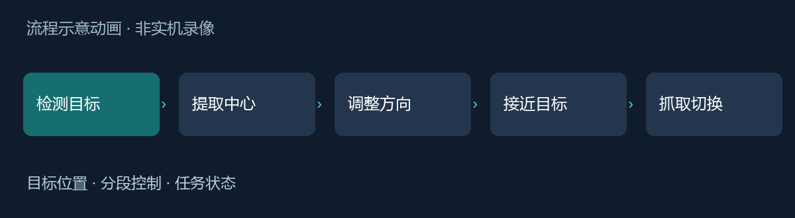
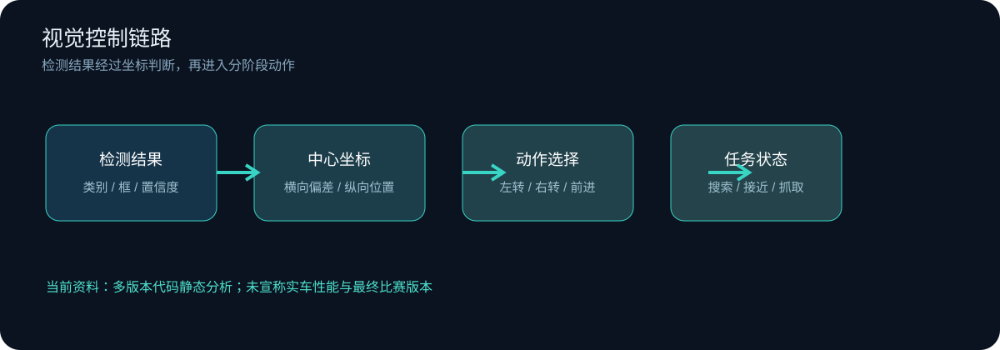

# 视觉引导救援小车｜控制流程学习记录

[](https://github.com/daylight-bit/vision-rescue-robot) [](docs/design-notes.md)


围绕智能救援比赛代码，整理摄像头检测结果如何进入小车运动与抓取流程。重点关注目标选择、图像坐标、任务状态和执行反馈之间的关系。



*根据代码整理的原理示意动画，不是小车实机录像，不代表比赛完成率。*

## 结构图




## 从代码看控制链路

现有资料包含多种试验版本：ROS2 检测结果订阅、BPU 推理调用，以及 HSV 颜色分割脚本。它们不能直接当作同一最终版本的同时运行组件。

ROS2 版本根据检测框计算中心点，再用横向阈值选择转向动作；任务阶段由状态变量控制。部分脚本还通过编码器脉冲累计判断运动终止，并调用舵机接口完成抓取动作。

## 值得深入的问题

- 目标突然丢失时，默认坐标是否会触发错误运动？
- 像素坐标可以用于对齐，但能否直接当作物理距离？
- 编码器累计脉冲能判断转动量，但地面打滑会带来什么误差？
- 状态切换、延时动作和检测更新如何互相影响？

[控制链路与后续实验](docs/design-notes.md)

## 功能线索

| 环节 | 输入 | 输出 |
|---|---|---|
| 目标检测 | 图像/检测结果 | 目标中心位置 |
| 方向调整 | 横向偏差 | 分段转向动作 |
| 接近判断 | 纵向位置或编码器变化 | 阶段切换 |
| 任务执行 | 状态变量 | 行走、抓取等动作 |

## 仓库结构

```text
README.md                 控制链路与已知限制
docs/design-notes.md      坐标、状态和实验计划
assets/cover.png          项目封面
assets/architecture.svg   分层结构图
demo/index.html           可操作的本地演示
assets/workflow.gif       原理示意动画
demo/index.html           可操作的本地演示
```

## 可操作演示

[打开本地交互 Demo](demo/index.html)（下载仓库后直接用浏览器打开）。页面使用虚拟数据，用来展示交互逻辑。

## 当前进度

已完成指定代码片段的静态分析和控制流程示意，未在 RDK 或实车上重新测试。启动说明引用的部分最终文件与现有目录不一致，因此不宣称当前资料可一键复现最终比赛版本。个人具体代码贡献尚未按文件核对，本仓库暂不作独立开发或模型训练声明。
